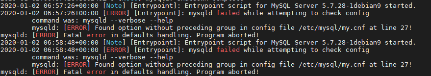

最近在学习canal相关知识，于是修改docker中mysql的配置文件`mysqld.cnf`，修改后执行`docker restart mysql`后发现没有起来，执行`docker logs -f --tail 10 mysql`，出现如下的错误：



既然配置文件出错了，那改过来就好了，但是执行`docker exec -it mysql /bin/bash`准备先进入容器再更改配置，发现进不去！！！因为exec命令只适用于正在运行的容器。

# 解决方式

## 方式一

在当前主机中存放了docker容器中的配置信息（一般默认目录是：`/var/lib/docker/overlay/`），那只要找到这个配置文件，修改后就可以重新启动了。

## 方式二

使用`docker cp`命令，把docker容器中的配置文件复制到主机中来，然后修改完后再复制到docker容器中去。

# 具体操作

经过实操，方式一的方式会比较麻烦，这里只介绍方式二。

### 1、将docker容器内的文件拷贝至宿主机中

```Bash
docker cp mysql:/etc/mysql/mysql.conf.d/mysqld.cnf .
```

> **注：****`.`****代表是当前目录**

### 2、vim修改配置文件中出错的地方，重新修改回来

### 3、复制修改后的配置文件到docker容器中去

```Bash
docker cp my.cnf mysql:/etc/mysql/my.cnf
```

### 4、重启容器实例

```Bash
docker restart mysql
```

**最后成功启动！！！**