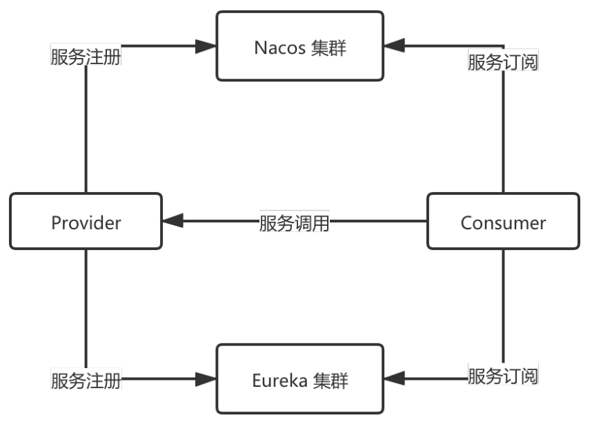
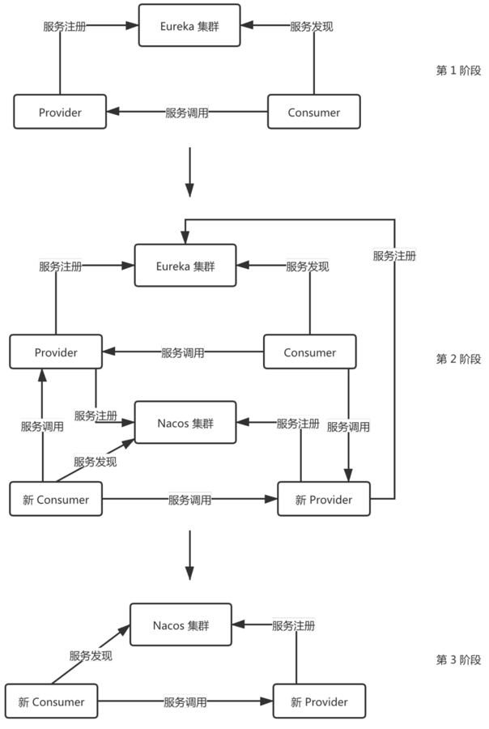

双注册双订阅表示一个Provider应用可以将自身的实例信息注册到多个注册中心上，一个Consumer应用可以订阅到多个注册中心上的服务实例信息。

如图所示，Provider可以把自身的服务实例信息注册到Nacos和Eureka集群上，Consumer发起服务订阅的时候可以从Nacos和Eureka上订阅服务。



# 1. 双注册双订阅模式分析

Spring Cloud自身的编程模型是支持双注册双订阅模式的。在服务注册侧，Spring Cloud各个注册中心都有AutoServiceRegistration的实现类，比如，NacosAutoServiceRegistration和EurekaAutoServiceRegistration实现在类内部完成服务的注册。这些AutoServiceRegistration的实现类都实现了 Lifecycle接口，在start过程中完成服务注册操作。

在服务订阅侧，DiscoveryClient 统一了Spring Cloud服务发现的操作。其中，CompositeDiscoveryClient是一个特殊的DiscoveryClient实现：

```Java
package org.springframework.cloud.client.discovery.composite;

import java.util.ArrayList;
import java.util.Collections;
import java.util.Iterator;
import java.util.LinkedHashSet;
import java.util.List;
import org.springframework.cloud.client.ServiceInstance;
import org.springframework.cloud.client.discovery.DiscoveryClient;
import org.springframework.core.annotation.AnnotationAwareOrderComparator;

public class CompositeDiscoveryClient implements DiscoveryClient {
    private final List<DiscoveryClient> discoveryClients;

    public CompositeDiscoveryClient(List<DiscoveryClient> discoveryClients) {
        AnnotationAwareOrderComparator.sort(discoveryClients);
        this.discoveryClients = discoveryClients;
    }

    public String description() {
        return "Composite Discovery Client";
    }

    public List<ServiceInstance> getInstances(String serviceId) {
        if (this.discoveryClients != null) {
            Iterator var2 = this.discoveryClients.iterator();

            while(var2.hasNext()) {
                DiscoveryClient discoveryClient = (DiscoveryClient)var2.next();
                List<ServiceInstance> instances = discoveryClient.getInstances(serviceId);
                if (instances != null && !instances.isEmpty()) {
                    return instances;
                }
            }
        }

        return Collections.emptyList();
    }

    public List<String> getServices() {
        LinkedHashSet<String> services = new LinkedHashSet();
        if (this.discoveryClients != null) {
            Iterator var2 = this.discoveryClients.iterator();

            while(var2.hasNext()) {
                DiscoveryClient discoveryClient = (DiscoveryClient)var2.next();
                List<String> serviceForClient = discoveryClient.getServices();
                if (serviceForClient != null) {
                    services.addAll(serviceForClient);
                }
            }
        }

        return new ArrayList(services);
    }

    public List<DiscoveryClient> getDiscoveryClients() {
        return this.discoveryClients;
    }
}

```

在 getInstances 方法中，会聚合所有的 DiscoveryClient 实现类找到的服务名，也会遍历每个DiscoveryClient查询服务名对应的实例信息。

下面在一个应用里分别加上 Nacos （com.alibaba.cloud:spring-cloud-starter-alibaba-nacos-discovery）和 Eureka（org.springframework.cloud:spring-cloud-starter-netfix-eureka-client）依赖，用来完成双注册双订阅。

应用启动后，会出现以下报错信息：

```JavaScript
***************************
APPLICATION FAILED TO START
***************************

Description:

Field autoServiceRegistration in org.springframework.cloud.client.serviceregistry.AutoServiceRegistrationAutoConfiguration required a single bean, but 2 were found:
  - nacosAutoServiceRegistration: defined by method 'nacosAutoServiceRegistration' in class path resource [com/alibaba/cloud/nacos/registry/NacosServiceRegistryAutoConfiguration.class]
  - eurekaAutoServiceRegistration: defined by method 'eurekaAutoServiceRegistration' in class path resource [org/springframework/cloud/netflix/eureka/EurekaClientAutoConfiguration.class]


Action:

Consider marking one of the beans as @Primary, updating the consumer to accept multiple beans, or using @Qualifier to identify the bean that should be consumed
```

从这个报错信息可以很明显地看出，ServiceRegistryAutoConfiguration 自动化配置类的内部类ServiceRegistryEndpointConfiguration内部依赖一个RegistrationBean，但是在Nacos和Eureka依赖内部分别会构造 NacosRegistration 和EurekaRegistration，这样会出现 ServiceRegistry-EndpointConfiguration 并不知道要注入哪个 Registration Bean 的问题。同理，AutoService-RegistrationAutoConfiguration内部的AutoServiceRegistration Bean也会引起一样的问题。

为了解决这个问题，可以在配置文件里过滤这两个自动化配置类：

```JavaScript
spring.autoconfigure.exclude=org.springframework.cloud.client.serviceregistry.ServiceRegistryAutoConfiguration,org.springframework.cloud.client.serviceregistry.AutoServiceRegistrationAutoConfiguration
```

加上该配置之后，还需要通过@EnableConfigurationProperties 注解让AutoServiceRegistration-Properties 配置类生效。这是因为所有的AutoServiceRegistration 实现类在构造过程中都需要这个配置类Bean。

有了这两个条件之后，即可享受双注册双订阅模式。

# 2. 案例：使用双注册双订阅模式将Eureka注册中心迁移到Nacos注册中心

假设某公司原先使用 Eureka 作为注册中心，Nacos 开源之后，该公司想把Eureka替换成Nacos注册中心，要求在这个过程中对客户没有任何影响，也不能造成业务损失。

对于这个场景，可以使用双注册双订阅方案来完成任务。如图所示，这是一个3个阶段的过程图。



第1阶段：Eureka作为注册中心，Provider完成服务注册，Consumer完成服务发现。

第2阶段：双注册双订阅的核心阶段，该阶段内部包括以下4个操作。

- 上线新的Provider（拥有双注册能力），这时Eureka 注册中心的Provider有两个实例。
- 下线旧的 Provider，下线之后由于新 Provider 也会注册到 Eureka 上，这时旧的Consumer可以找到新Provider的实例。
- 上线新的 Consumer（拥有双订阅能力），新 Consumer 可以订阅 Nacos 和Eureka 集群的服务实例，这时可以订阅到Nacos上的服务实例。
- 下线旧的Consumer。

第3阶段：Eureka下线，使用Nacos替换Eureka作为新的注册中心，Provider和Consumer的服务注册和服务发现操作只与Nacos交互。
