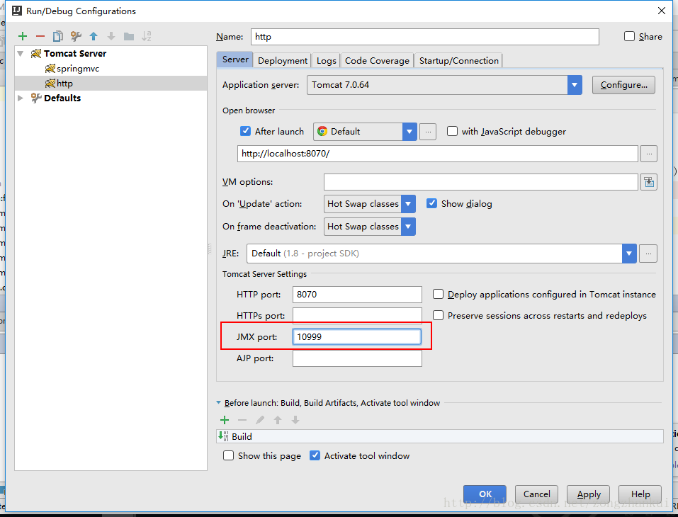

修改conf目录下的server.xml文件的三处：

1. 修改http访问端口（默认为8080端口）
```
<Connector port="8080" protocol="HTTP/1.1"
           connectionTimeout="20000"
           redirectPort="8443" />
```
2. 修改Shutdown端口（默认为8005端口）
```
<Server port="8005" shutdown="SHUTDOWN">
```
3. 修改JVM启动端口（默认为8009端口）
```
<Connector port="8009" protocol="AJP/1.3" redirectPort="8443" />
```

 如果使用IDEA集成tomcat开发项目，需要同时部署两个项目到不同的tomcat并启动，则还需要修改JMXport。
 

**参考：**[http://www.blogjava.net/allen-zhe/archive/2007/01/15/93981.html](http://www.blogjava.net/allen-zhe/archive/2007/01/15/93981.html)